<a name="readme-top"></a>

<br />
<div align="center">


<h3 align="center">Grapha</h3>

<p align="center">
Application de visualisation et d'algorithmes de graphes, conçue et développée pour le projet de SAÉ 5.01.
<br />

<a href="#introduction"><strong>Explorer la documentation »</strong></a>
<br />
</p>
</div>
<div align="center">

[![Python][python]][python-url]
[![Tkinter][tkinter]][tkinter-url]
[![Custom TKinter][custom-tkinter]][custom-tkinter-url]
[![Pillow][pillow]][pillow-url]


</div>
<br />
<br />
<details>
<summary>Table des matières</summary>
<ol>
    <li>
        <a href="#introduction">Introduction</a>
    </li>
    <li>
        <a href="#bien-commencer">Bien commencer</a>
        <ul>
            <li><a href="#prérequis">Prérequis</a></li>
            <li><a href="#installation">Installation</a></li>
        </ul>
    </li>
    <li>
        <a href="#utilisation">Utilisation</a>
    </li>
    <li>
        <a href="#la-grille">La grille</a>
    </li>
    <li>
        <a href="#contributeurs">Contributeurs</a>
    </li>
</ol> 
</details>

## Introduction

Grapha est une application de visualisation et d'algorithmes de graphes, conçue et développée pour le projet de SAÉ 5.01. Elle permet de visualiser des graphes, de les manipuler et d'appliquer différents algorithmes sur ces derniers.


Elle regroupe les fonctionnalités suivantes :

- Visualisation de graphes
- Application d'algorithmes sur les graphes
- Une interface utilisateur simple et intuitive
- Une approche pédagogique pour les algorithmes
- ...

<p align="right">(<a href="#readme-top">Retour en haut</a>)</p>


## Bien commencer

### Prérequis

Pour utiliser l'application, vous devez avoir installé les logiciels suivants :
- [Python][python] (version 3.8 ou supérieure)
- [Tkinter][tkinter] (inclus dans Python)
- [Pillow][pillow] (inclus dans le projet)
- [Custom Tkinter][custom-tkinter] (inclus dans le projet)
- Un éditeur de texte (recommandé : [Visual Studio Code](https://code.visualstudio.com/))

### Installation

Pour obtenir une copie locale du projet, suivez ces étapes simples.

1. Cloner le dépôt
   ```sh
   git clone https://github.com/EwenDev/Grapha.git
   ```
   
2. Ouvrez le projet dans votre éditeur de texte.


3. Exécutez la commande suivante dans le terminal de VSC pour installer les dépendances
   ```sh
   pip install -r requirements.txt
   ```
   
4. Exécutez le fichier `main.py` pour lancer l'application ou exécuter la commande suivante dans le terminal de VSC
   ```sh
   python main.py
   ```
   
## Utilisation

Pour utiliser l'application, suivez ces étapes simples.

1. Après avoir lancé l'application, vous verrez une fenêtre principale avec un menu en haut et à gauche ainsi une zone de dessin au centre
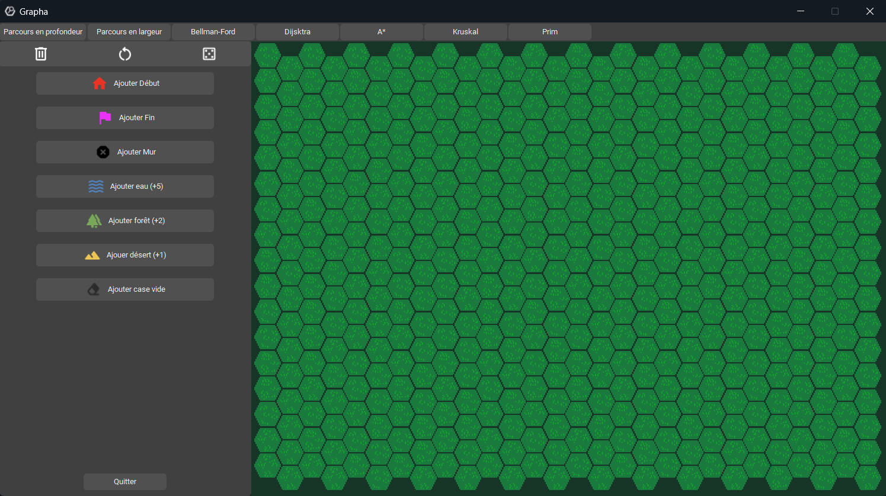
   

2. Dans un premier temps, concentrons-nous sur la barre du haut. Cela vous permettra de choisir entre différents algorithmes.
Vous y trouverez les options suivantes :
   - Parcours en profondeur
   - Parcours en largeur
   - Bellman-Ford
   - Dijkstra
   - Kruskal
   - Prim

> Note : Si vous cliquez sur un algorithme, un point de départ et de fin seront ajoutés aux extrémités du graphe. Vous pouvez les déplacer à l'aide de la souris pour les placer où vous le souhaitez avec les outils de dessin.

3. Dans un second temps, concentrons-nous sur la barre de gauche. Cela vous permettra de choisir entre différents outils de dessin. Tout en haut de cette barre, vous trouverez les options plus générales sur le graphe. En dessous, vous trouverez les options de dessin.
Voici les options disponibles :
    -  Supprimer : Supprime la carte actuelle.
    -  Réinitialiser : Réinitialise les résultats des algorithmes.
    -  Aléatoire : Génère une carte aléatoire.
    -  Ajouter début : Ajoute un point de départ au graphe.
    -  Ajouter fin : Ajoute un point de fin au graphe.
    -  Ajouter mur : Ajoute un mur infranchissable au graphe.
    -  Ajouter eau : Ajoute un poids de 5 au graphe quand on passe dessus.
    -  Ajouter forêt : Ajoute un poids de 2 au graphe quand on passe dessus.
    -  Ajouter désert : Ajoute un poids de 1 au graphe quand on passe dessus.
    -  Effacer : Efface les éléments du graphe.
    
    
4. Pour dessiner un graphe, vous pouvez utiliser les outils de dessin. Vous pouvez également déplacer les points de départ et de fin à l'aide de la souris.


5. Pour appliquer un algorithme, cliquez sur l'option correspondante dans la barre du haut. Vous verrez le résultat de l'algorithme ainsi que les distances s'afficher sur le graphe.
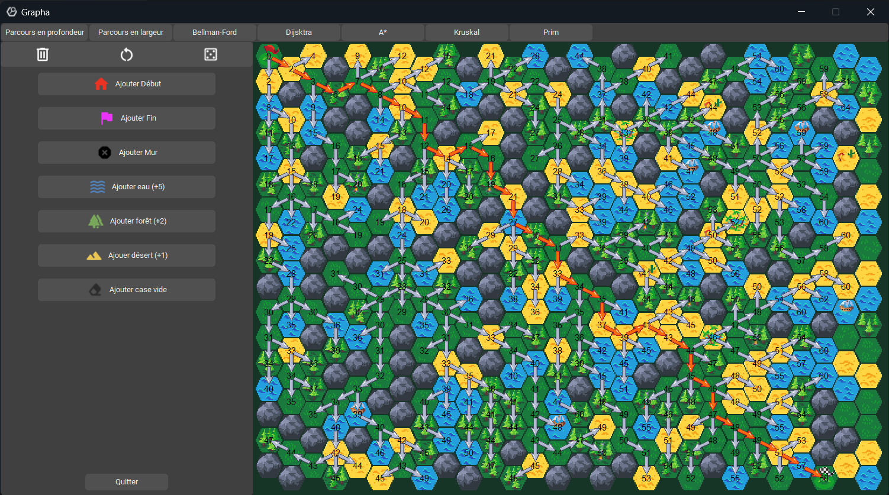


6. Pour effacer le graphe, cliquez sur l'option supprimer dans la barre de gauche.


> Attention : Les algorithmes de parcours en profondeur et en largeur, prim et kruskal ne fonctionnent pas avec les poids. Pour les autres algorithmes, les poids sont pris en compte.
> 
> Exemple avec l'algorithme de parcours en largeur :
> 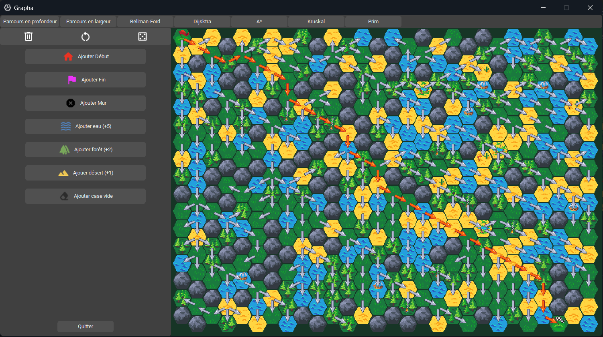

## La grille

Comme expliqué la grille est composée de plusieurs types d'hexagones. Les textures d'un type (par exemple désert ou forêt) sont choisies aléatoirement lors du placement par l'utilisateur. Voici les différents types d'hexagones que vous pouvez rencontrer :

<div style="display:flex; align-items: center; gap: 10px">


<span>L'herbe représente une case de base, qui n'a pas d'influence sur la résolution de l'algorithme. </span>
</div>

<br>
<div style="display:flex; align-items: center; gap: 10px">

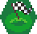
<span>Ces deux drapeaux représentent le départ et l'arrivée de l'algorithme, on ne peut en placer qu'un seul de chaque sur la grille. </span>
</div>

<br>
<div style="display:flex; align-items: center; gap: 10px">
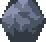
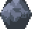
<span>Les murs sont des obstacles infranchissables pour l'algorithme, il ne peut pas passer par dessus. </span>
</div>

<br>
<div style="display:flex; align-items: center; gap: 10px">


<span>L'eau représente un poids de 5, l'algorithme préférera éviter de passer par dessus. </span>
</div>

<br>
<div style="display:flex; align-items: center; gap: 10px">

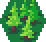
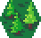
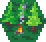
<span>La forêt représente un poids de 2, avec un coût intermédiaire pour l'algorithme. </span>
</div>

<br>
<div style="display:flex; align-items: center; gap: 10px">


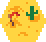
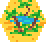
<span>Le désert représente un poids de 1, avec un coût faible pour l'algorithme.</span>
</div>

<br>
<div style="display:flex; align-items: center; gap: 10px">


<span>Les flèches grises indiquent les différentes directions empruntées par l'algorithme lors de son exécution. Les flèches rouges indiquent le chemin le plus court. </span>
</div>

---

## Contributeurs

<table>
  <tbody>
    <tr>
      <td align="center" valign="top" width="14.28%"><a href="https://github.com/NoXeDev"><br /><sub><b>NoXeDev</b></sub></a></td>
      <td align="center" valign="top" width="14.28%"><a href="https://github.com/EwenDev"><br /><sub><b>EwenDev</b></sub></a></td>
      <td align="center" valign="top" width="14.28%"><a href="https://github.com/ComeRegnier"><br /><sub><b>ComeRegnier</b></sub></a></td>
      <td align="center" valign="top" width="14.28%"><a href="https://github.com/HighMax524"><br /><sub><b>HighMax524</b></sub></a></td>
      <td align="center" valign="top" width="14.28%"><a href="https://github.com/ldv500"><br /><sub><b>ldv500</b></sub></a></td>
      <td align="center" valign="top" width="14.28%"><a href="https://github.com/BluenessDev"><br /><sub><b>BluenessDev</b></sub></a></td>
    </tr>
  </tbody>
</table>

Merci à [SolareFlame](https://github.com/SolareFlame) pour l'aide apportée sur le design graphique de l'application.


[python]: https://img.shields.io/badge/Python%20-8F33B0?style=for-the-badge&logo=python&logoColor=white
[python-url]: https://www.python.org/
[tkinter]: https://img.shields.io/badge/Tkinter%20-005AFF?style=for-the-badge&logo=python&logoColor=white
[tkinter-url]: https://docs.python.org/3/library/tkinter.html
[custom-tkinter]: https://img.shields.io/badge/Custom%20Tkinter%20-EEA8AA?style=for-the-badge&logo=python&logoColor=black
[custom-tkinter-url]: https://docs.python.org/3/library/tkinter.html
[pillow]: https://img.shields.io/badge/Pillow%20-AA0000?style=for-the-badge&logo=python&logoColor=white
[pillow-url]: https://pillow.readthedocs.io/en/stable/